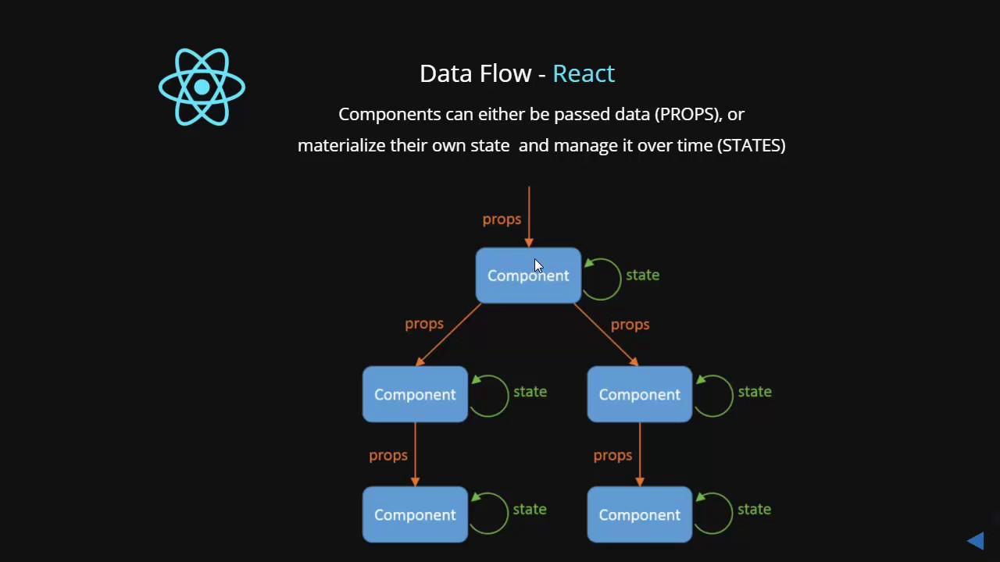

#  Unidirectional Data Flow

### Learning Objectives
*After this lesson, you will be able to:*
- Define unidirectional flow
- Diagram data in a component hierarchy

## What is Unidirectional Data Flow?

Let's start with [a video explaining this concept.](https://generalassembly.wistia.com/medias/v2uenqkgwk).

In React applications, data usually flows from the top down. Why do we care? How does this apply?

When several components in a view need to share `state`, you lift, or **hoist**, the `state` so that it's available to all the components that need it. Define the state in the highest component you can, so that you can pass it to any components which will need it.

Here they are in a diagram - 

## Final Thoughts

It's important that you think through your applications before you start writing
code. It's often helpful to sketch out your app, and identify:
- the **components** you will need
- the **states** you will need
- where those states need to live

Use the unidirectional data flow pattern - hoist your state toward the top of the 
component tree so it's available to the children that need it.
