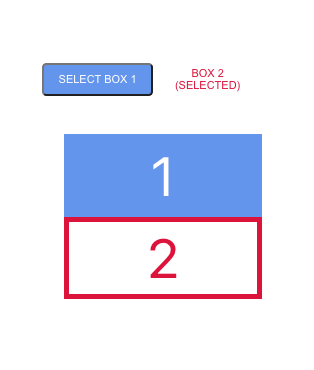

# Box Selector in React

### GOAL

The goal of this warmup is to gauge your ability to develop a minimal ReactJS application that renders user-defined components, incorporating dynamic styling and reacts to some basic user interaction.

### OVERALL APPLICATION REQUIREMENTS

The application, as you will soon see in the demo, requires that you code two components, `<BoxSelector>` and `<Boxes>`, and render them within the existing `<App>` component.

When the user clicks one of the two buttons in `<BoxSelector>`, the corresponding "box" within the `<Boxes>` component will be styled differently to make it appear "selected".

In addition, the button clicked within `<BoxSelector>` has its text changed and is also styled differently to make it look "selected" as well.

#### Setup

1. Open Terminal.
2. Move to the bootcamp directory.
3. Create the React app with this command `npx create-react-app box-selector`.
4. When the process has completed, `$ cd box-selector`.

#### Steps

1. Replace the contents of **App.js** with this "cleaned up" starter code:

	```js
	import React, { Component } from 'react';
	import './App.css';
	
	export default class App extends Component {
	  render() {
	    return (
	      <div className="App">
	        <header className="App-header">Box-Selector</header>
	        <main>
	          YOUR TWO COMPONENTS WILL GO HERE
	        </main>
	      </div>
	    );
	  }
	}

	```

2. Replace the contents of **App.css** with the following CSS that uses flexbox to layout `<App>`:

```css
body, * {
  box-sizing: border-box;
}

.App {
  height: 100vh;
  display: flex;
  flex-direction: column;
  justify-content: center;
  align-items: center;
}

.App main {
  display: flex;
  flex-direction: column;
  justify-content: center;
  align-items: center;
  flex: 1;
}
```

3. Create the `<BoxSelector/>` and `<Boxes/>` components and ensure they are functional components. Add classnames "BoxSelector" and "Boxes" to each div in their respective js files. Then render BoxSelector and Boxes in App.js.

4.  Add the following CSS to App.css

```css
.BoxSelector {
  display: flex;
  padding: 50px;
  justify-content: space-around;
  align-items: center;
  height: 100px;
  width: 300px;
  border-radius: 8px;
  margin-right: 20px;
}

.BoxSelector button {
  height: 30px;
  width: 200px;
  background-color: cornflowerblue;
  color: white;
  border-radius: 4px;
  text-transform: uppercase;
  cursor: pointer;
  outline: none;
  font-size: 10px;
}

.BoxSelector button:hover {
  background-color: crimson;
}

.BoxSelector button.selected {
  background-color: white;
  color: crimson;
  border: none;
  cursor: default;
}

.Boxes {
  display: flex;
  flex-flow: row wrap;
  justify-content: space-around;
  align-items: center;
  height: 100px;
  width: 200px;
  border-radius: 8px;
}

.Boxes div {
  height: 75px;
  width: 200px;
  display: flex;
  justify-content: center;
  align-items: center;
  background-color: cornflowerblue;
  color: white;
  font-size: 50px;
  border: 5px solid cornflowerblue;
  margin: auto 10px;
}

.Boxes div.selected {
  background-color: white;
  color: crimson;
  border: 5px solid crimson;
}
```

5. Add two divs inside the Boxes.js component. Hardcode the innerHTML of each div to be 1 and 2. These represent the boxes on screen. Make their className dynamic, switching between a class of "selected" and "". 

Examples: 
- ```className={props.button === 1 ? "selected" : ""}```
- ```className={props.button === 2 ? "selected" : ""}```

6. Add two buttons inside the BoxSelector.js component. These represent the buttons onscreen. Also make their class dynamic as we did in step 5. 

7. Create two state variables in App.js. These should be ```button``` and ```message```. ```button``` represents the button selected. The defaults for ```button``` and ```message``` should be 1 and 'BOX 1 (SELECTED)', respectively. Note that since we're using ```button``` as a prop in steps 5 and 6, we need to pass down ```button``` into Boxes.js and BoxSelector.js

8. Create a ```handleSelect``` arrow function. You do not need to pass ```event``` or ```e``` here. 

    - All you need to pass is an "incomingButton" parameter that will be filled based on which button was selected. Hint: "incomingButton" is just a button number. 

    - All handleSelect will do is setState on the ```button``` and ```message```. Depending on button selected, message should become ```BOX ${incomingButton} (SELECTED)```

    - Pass this function down into BoxSelector.js.

9. Call ```handleSelect``` onClick to each button inside of BoxSelector.js and make sure to pass the appropriate number based on box selected.

10. Pass ```message``` as a prop into BoxSelector.js from App.js.

11. Set the innerHTML of each button to be a ternary. 

    Example : ```{props.button === 1 ? props.message : "SELECT BOX 1"}```

# Wireframe:

